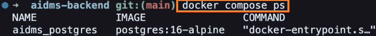
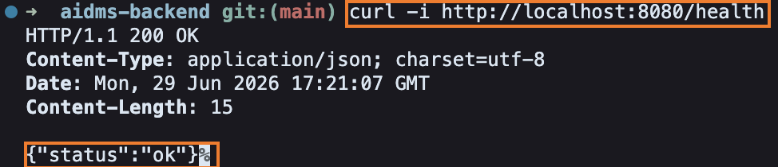
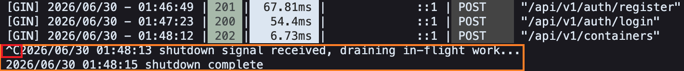
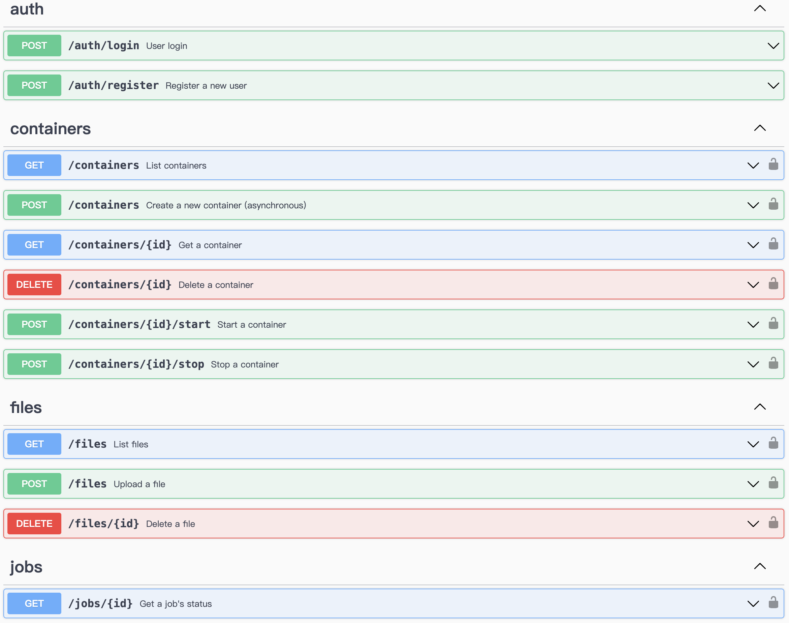
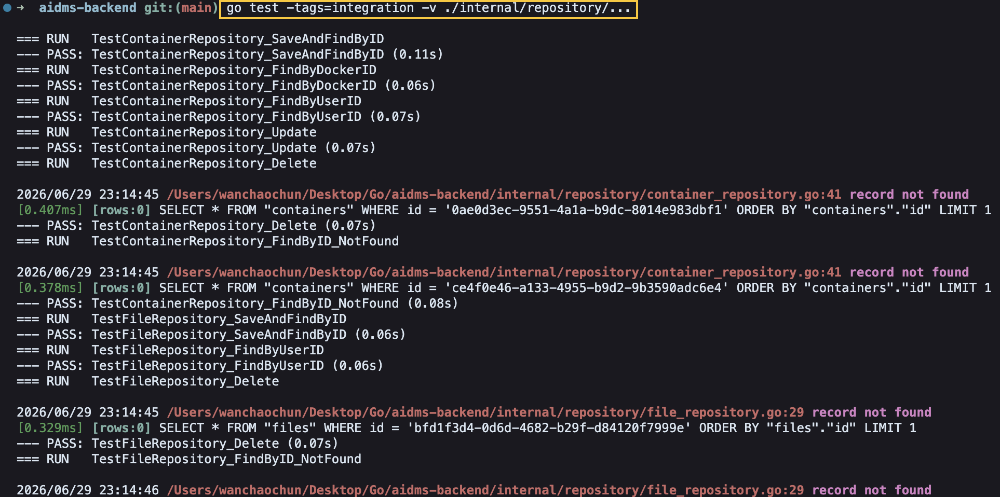
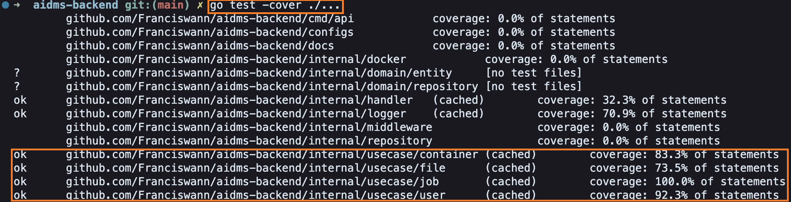

# AIDMS Backend

A container management backend written in Go: users can register and log in, upload files, and manage their own Docker containers (create/start/stop/delete) through a RESTful API. It also ships with a pluggable, asynchronous logging system.

## Overview

AIDMS Backend is built with a four-layer Clean Architecture, using dependency inversion to decouple business logic from PostgreSQL, the Docker SDK, and other external tools. Every user's containers and files are isolated from each other, container creation runs as an asynchronous job (so it never blocks the HTTP request), and the server supports graceful shutdown.

### Tech Stack

| Category | Choice |
|---|---|
| Language | Go 1.25.6 |
| Web framework | Gin |
| ORM | GORM |
| Database | PostgreSQL 16 |
| Container runtime | Docker SDK for Go |
| API docs | swaggo/swag |
| Testing | testify |

## Architecture

A four-layer Clean Architecture, where dependencies only ever point inward and the innermost layer imports no third-party packages.

<!-- TODO: architecture diagram -->

```
Frameworks & Drivers     cmd/api/main.go, Gin, GORM, Docker SDK, swaggo
         ↓
Interface Adapters       internal/handler/, internal/repository/, internal/docker/, internal/middleware/
    ↓
Use Cases                internal/usecase/{container,user,file,job}/, internal/logger/
  ↓
Domain                   internal/domain/entity/, internal/domain/repository/
```

### Project layout

```
.
├── cmd/api/                       # entry point: dependency wiring + server startup
├── configs/                       # configuration / environment variables
├── internal/
│   ├── domain/
│   │   ├── entity/                # Domain entities (User, Container, File, Job)
│   │   └── repository/            # Repository interfaces (defined by the Use Case layer)
│   ├── repository/                # GORM implementations of those interfaces + models
│   ├── usecase/                   # business logic
│   ├── docker/                    # Docker SDK wrapper
│   ├── handler/                   # Gin HTTP handlers
│   ├── middleware/                # auth + logging middleware
│   └── logger/                    # pluggable logging system
└── docker-compose.yml             # local PostgreSQL
```

Integration tests live next to the code they test, named `*_integration_test.go` and gated behind a `//go:build integration` tag, so the default `go test ./...` never needs a real database. Run them with `go test -tags=integration ./...` against a live PostgreSQL.

For the full rationale behind each architectural decision (in Chinese), see [`docs/ARCHITECTURE.md`](docs/ARCHITECTURE.md).

## Features

- **Authentication**: register/login, bcrypt password hashing, JWT (HS256) issuance and verification
- **Container management**: create (asynchronously), start, stop, delete, and list — all scoped to the owning user
- **Asynchronous jobs**: container creation immediately returns `202` + a Job; the actual work happens in the background and can be polled via `GET /jobs/{id}` (`pending → running → success/failed`)
- **File upload**: per-user storage directories, server-generated UUID filenames to prevent path traversal
- **Pluggable logging system**: see [`internal/logger/DESIGN.md`](internal/logger/DESIGN.md) — four core interfaces (`LogEntry`/`LogWriter`/`LogReader`/`LogHandler`), swappable storage (file / in-memory), severity filtering, ordered async writes, structured JSON output
- **Graceful shutdown**: listens for `SIGINT`/`SIGTERM` and waits for in-flight requests and background jobs to finish before exiting
- **Swagger API docs**: interactive docs at `/swagger/index.html`

## Installation

### Prerequisites
- Go 1.25.6+
- Docker / Docker Compose (for local PostgreSQL, and a Docker daemon for the container features themselves)

### Setup

```bash
# 1. Start PostgreSQL
docker-compose up -d

# 2. Install dependencies
go mod download

# 3. Create a .env file (JWT_SECRET is required, everything else has a default)
cat > .env <<EOF
JWT_SECRET=dev-only-do-not-use-in-prod
EOF
```

Confirm PostgreSQL is healthy before moving on:

```bash
docker-compose ps
```



## Quick Start

```bash
go run ./cmd/api
```

Once it's running, open **`http://localhost:8080/swagger/index.html`** for the interactive API docs — **strongly recommended** over raw curl commands, since you can authorize once with a JWT and click through every endpoint from the browser.

To quickly check the server is alive:

```bash
curl -i http://localhost:8080/health
```



You can also exercise the full flow with curl. The commands below extract values from JSON responses with [`jq`](https://jqlang.github.io/jq/) — install it first if you don't have it:

```bash
brew install jq     # macOS (requires Homebrew: https://brew.sh)
sudo apt install jq # Debian/Ubuntu
```

```bash
# Register
curl -i -X POST localhost:8080/api/v1/auth/register -H 'Content-Type: application/json' \
  -d '{"email":"demo@example.com","password":"password123"}'

# Log in and store the JWT
TOKEN=$(curl -s -X POST localhost:8080/api/v1/auth/login -H 'Content-Type: application/json' \
  -d '{"email":"demo@example.com","password":"password123"}' | jq -r .token)
echo "Token: $TOKEN"

# Create a container (asynchronous - returns 202 + a Job immediately)
JOB=$(curl -s -X POST localhost:8080/api/v1/containers -H "Authorization: Bearer $TOKEN" \
  -H 'Content-Type: application/json' -d '{"image":"alpine:latest","name":"demo"}')
echo "$JOB"
JOB_ID=$(echo "$JOB" | jq -r .id)

# Poll the job until it finishes (pending -> running -> success/failed)
curl -i localhost:8080/api/v1/jobs/$JOB_ID -H "Authorization: Bearer $TOKEN"
```

### Graceful shutdown

To see graceful shutdown in action, run the container-creation request above, then immediately switch to the terminal running `go run ./cmd/api` and press `Ctrl+C` while the job is still in flight. The server waits for the in-flight job to finish before exiting:



## API Documentation

The full interactive docs live at `/swagger/index.html`. Quick reference:

```
POST   /api/v1/auth/register
POST   /api/v1/auth/login

GET    /api/v1/containers
POST   /api/v1/containers              # asynchronous: returns 202 + a Job, creates in the background
GET    /api/v1/containers/{id}
POST   /api/v1/containers/{id}/start
POST   /api/v1/containers/{id}/stop
DELETE /api/v1/containers/{id}

GET    /api/v1/files
POST   /api/v1/files                   # multipart/form-data, field name "file"
DELETE /api/v1/files/{id}

GET    /api/v1/jobs/{id}               # poll async job status: pending/running/success/failed
```


Every route except `/auth/*` requires an `Authorization: Bearer {token}` header with the JWT from login.

## Testing

```bash
# Unit tests (mocked, no external dependencies)
go test ./...

# Integration tests (need PostgreSQL running; each test rolls back its own DB transaction)
go test -tags=integration ./...

# With the race detector
go test -race ./...
```


Coverage includes: unit tests for all four Use Case services (User/Container/File/Job), integration tests for all four repositories against real PostgreSQL, an HTTP-layer test for `ContainerHandler` (`httptest` + a mock usecase), and tests for `internal/logger`'s async write ordering and severity filtering.

Use Case layer coverage: 73–100% across all four services (`go test -cover ./...`)



## Roadmap

- **Concurrency control**: the same container can currently be `Start`/`Stop`/`Delete`d by two concurrent requests with no mutual exclusion. Plan: a `sync.Map[string]*sync.Mutex` keyed by container ID inside `ContainerService`, acquired via `LoadOrStore` before `Start`/`Stop`/`Delete`, so operations on the same container serialize while different containers stay fully parallel.
- **Zero-allocation logging**: pool `LogEntry` objects with `sync.Pool`, replace `Fields() map[string]interface{}` with a fixed-field representation. Details in [`internal/logger/DESIGN.md`](internal/logger/DESIGN.md).

## License

[MIT](LICENSE)
